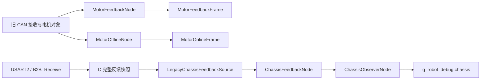

# 插件框架进度与后续计划

整理日期：2026-10-09，时间统一按北京时间（UTC+8）。

后续更新：正文保留最初整理的阶段快照，最新状态见下表及 [通用快照与结果对比接口](通用快照与结果对比接口-2026-10-09.md)。用户已取消逐板块 Keil 确认；旧源码保持原样。正文中 20 节点、二次快照取样、节点探针未调用和等待逐板块确认等描述属于后续修正前状态。

## 最新交付状态

| 项目 | 当前事实 |
| --- | --- |
| 已完成 | 快照单次复制后判断、实际节点耗时探针、通用结果比较、独立状态算术链路及 Watch 接入 |
| 当前结构 | 原有框架 + ID 100–104 算术诊断；公共合成输入 → 两个独占状态的累计器 → 只读比较 → Debug |
| 默认规模 | 25 节点、14 条声明边、2 个计划，每计划 13 条有效边 |
| 已验证 | 29 条编译期契约断言、受影响文件目标语法检查、新 Keil 文件项结构和 99 个源文件路径、独立只读审查 |
| 当前等待 | 用户统一烧录观察初始化、Equal/Different、暂停/重置和实际帧耗时 |
| 未完成 | 本版本完整固件链接、上板验收、真实输入下两套业务及电机输出等价验证 |
| 下一步 | 按详细文档完成 Watch 观察；后续框架候选为异步结果生命周期、低频取值策略及更细时序统计 |
| 老代码保护 | 271 个旧 C/头文件/汇编及 .ioc 的路径+SHA-256 整体指纹前后一致；旧输出路径保留 |
| 保存状态 | 本次新改动在当前工作区，未提交、未推送 |

下面是原始对话与阶段代码核对记录，保留当时的提交号和编译反馈。

依据：`Fix missing BSP source file` 对话、当前工作区源码、Git 本地记录、现有 Keil 构建日志。本文件记录截至本次核对时的事实和后续建议；“代码已实现”“用户编译通过”“实车验证通过”“已提交保存”分别判断。

## 1. 现在做到哪里了

当前已经建立 **STM32 + FreeRTOS 上的 C++17 插件框架、反馈观察链路及三组无硬件输出的框架演示**。统一节点、嵌套子图、固定容量执行图、强类型帧端口、条件分支、多套执行计划、路径生命周期通知、最新值邮箱均已有代码。

当前仍处于旁路阶段：旧 C 任务继续运行并负责硬件输出，新插件图读取部分反馈、运行演示并更新 `g_robot_debug`。底盘、云台、发射、遥控、视觉、裁判系统等旧业务尚未整体变成可独立拔插的插件。

**最新板块是“异步最新值邮箱”，用户已经确认 Keil 编译通过，不能再把它记为等待用户编译。** 当前主要未完成事项是：保存该板块的代码与验证记录、补齐框架实际缺口、继续异步结果生命周期等能力，以及按原约定统一烧录实车验收。

| 事项 | 截至本次核对的状态 |
| --- | --- |
| 最新实现板块 | `LatestSnapshotMailbox<T>`、STM32 快照锁、生产/消费演示及 Debug 字段 |
| 最新编译反馈 | 2026-10-09 20:11 用户回复“通过，继续”，之后多次重复确认 |
| 现有构建日志 | 包含 `SnapshotDemoNode.cpp`；`0 Error(s), 0 Warning(s)` |
| 基础上板观察 | 10 月 8 日用户反馈 `g_robot_debug` 已经在动；这只证明当时基础版本的观察结果 |
| 后续统一实车验收 | 没有完成记录；分支、计划、生命周期、邮箱及当前整图时序仍待验证 |
| 当前开发分支 | `改框架` |
| 当前 HEAD | `72db965`，节点路径生命周期通知 |
| 本地缓存的远程分支 | `upstream/改框架` 同为 `72db965`；本次未联网核验远端实时状态 |
| 邮箱提交状态 | 相关代码仍在工作区，部分文件尚未跟踪；没有对应的新提交 |
| 当前默认图 | **20 个节点、10 条声明边、2 套计划**；每套计划采用其中 9 条边 |

## 2. 对话中的方向和阶段结果

### 2.1 最初的构建问题

对话起点是 Keil 工程引用不存在的源文件，随后发展为插件框架设计与渐进实施。

已经处理的工程条目问题：

- 删除 7 个不存在的源文件引用：`super_cap.c`、`algorithm.c`、`controller.c`、`MahonyAHRS.c`、`user_lib.c`、`Filter.c`、`SMC.c`。
- 补入 `math/src/degree.c` 和 `math/src/dji_angle.c`，对应 `ModularDegreeTowards`、`ModularDJIAngleTowards` 未定义符号。
- 新增 C++ 框架文件后，修正 Keil C++ 文件类型；当前 15 个 `.cpp` 条目全部为 `FileType=8`。
- `g_robot_debug` 改为 `extern "C"` 全局符号，便于 Keil Watch 直接查找。

本次重新解析当前 `.uvprojx`：共 **98 个文件条目，缺失路径 0 个，C++ 类型错误 0 个**。这属于工程静态核查，不代表本次重新编译过固件。

### 2.2 已确认的框架方向

| 决策 | 当前应遵守的含义 |
| --- | --- |
| 渐进迁移 | 按板块交付、保持可编译；旧链路继续控制机器人 |
| 一切皆节点 | 所有层级继承同一个 `PluginNode`，每个节点都有内部图，可继续组合节点 |
| 所有权与依赖分离 | 对象可以层层持有，执行顺序由图边决定；支持多个起点、终点和交叉连接 |
| C++17 | 使用类、虚接口、模板、强类型枚举、RAII、静态成员组合 |
| 核心资源约束 | 核心与 STM32 侧关闭异常/RTTI，优先固定容量，避免常规业务生命周期依赖 `new/delete` |
| CubeMX 边界 | `.ioc` 和外设配置保留；生成文件保持 C；业务目录独立，通过 `USER CODE` 和 C ABI 接入 |
| 配置方式 | 编译期开关与启动期 C++ 组装结合；当前不引入 Flash/JSON 配置系统 |
| 1 kHz 基础帧 | 信号在统一帧下可读；未来允许算法降频，保持/滤波由明确节点承担 |
| 帧数据语义 | 图内按依赖同帧发布与读取；外部异步输入通过稳定快照交接 |
| 动态能力 | 运行期选预定义分支、切预验证计划；不任意增加、删除、重连图 |
| 业务保留 | 保留旧 C 算法、参数和状态机，用薄适配层接入；已停止“重写一套底盘解算”的方向 |
| 验证分工 | 每板块由用户 Keil 编译；旁路准备就绪后统一烧录实车；助手负责实现、静态核查及观察说明 |
| 未来上位机 | 保留 Linux/NUC、ROS 2、ONNX/RKNN 边界，当前不引入对应实现或主机仿真工程 |

不能为了旁路对比把同一个有状态的旧函数每周期调用两遍。旧函数若修改全局 PID、累计角度或发送硬件命令，应先观察它一次执行的输入输出；只有状态可独立实例化且输出副作用已隔离，才适合独立并行计算。

### 2.3 已实施板块与验证记录

| 板块 | 已完成内容 | 证据与边界 |
| --- | --- | --- |
| 基础骨架 | `PluginNode`、`PluginGraph`、状态码、静态容量、递归展开、拓扑排序、C 入口、FreeRTOS 任务 | 已提交 `9ada69c`；后来用户观察到 Debug 变化 |
| C++ 工程与注释 | Keil C++ 类型修正、函数/变量简短注释、Debug C 链接名 | 包括 `b03d542`、`ef77624` 等提交 |
| 类型化端口 | `FrameSignal<T>`、`InputPort<T>`、`OutputPort<T>` 和电机数据协议 | 已提交 `c2e2a86`；完整端口拓扑验证仍未实现 |
| 电机反馈适配 | 读取旧云台/发射机构电机数据，发布统一反馈帧 | 已提交 `4ec6582`；没有接管 CAN 输出 |
| 电机超时观察 | CAN 接收时记录最后反馈 tick，默认 100 ms 判断在线；新增 `MotorOfflineNode` | 已提交 `74035ee`；属于观察，不是完整故障/急停策略 |
| 底盘反馈观察 | USART2 下板反馈 → C 快照 → 源接口 → 反馈节点 → 观察节点 → Debug | 10 月 9 日 10:14 用户确认编译通过；随 `413b850` 保存 |
| 条件分支 | 选择器、后代继承条件、分支跳过、汇合和执行统计；算术演示输出 22/27 | 10 月 9 日 11:08 用户确认编译通过；`413b850` |
| 预验证计划切换 | 公共边/计划专属边、逐计划拓扑验证、帧边界切换；A→B/B→A 探针 | 10 月 9 日 11:36 用户确认编译通过；`31bf0cc` |
| 路径生命周期 | `onEnter/onExit/onPlanChanged`、激活集合、进入退出计数和演示状态重置 | 10 月 9 日 19:29 用户确认编译通过；`72db965` |
| 最新值邮箱 | 完整值、原始采样时间、发布序号、有效标志、TTL、锁接口、STM32 后端及演示 | 10 月 9 日 19:59 交付，20:11 用户确认通过；**尚未提交保存** |

邮箱交付后的多次“通过，继续”没有对应新的代码板块交付记录，部分后续轮次被中断。可以确认进度没有推进到下一板块；记录不足以断言中断的具体原因。

## 3. 现在等待什么

| 等待项 | 当前判断 | 处理方式 |
| --- | --- | --- |
| 用户确认邮箱编译 | **已经满足** | 更新状态，继续工作，不重复索要同一确认 |
| 保存邮箱板块 | 尚未完成 | 按原对话保存到 GitHub 的约定，核对并提交相关源文件、配置、工程条目和文档 |
| 下一板块开发 | 尚未实施 | 先处理第 6 节中影响异步接口正确性的缺口，再推进第 7 节计划 |
| 当前整图实车观察 | 尚未完成 | 由用户按约定统一烧录，核对第 8 节观察项 |
| 旧输出接管/旧代码删除 | 前置条件未满足 | 先完成真实业务适配、输出比较、唯一输出权和接管验证 |
| Linux、ROS 2、模型接入 | 明确属于后续阶段 | 现在保留接口约束；平台和模型契约准备后再做后端 |

后续具体实现前需明确的内容包括：异步结果允许保留多久、超时后使用何种输出、事件是否必须逐条交付、路径切换后如何废弃旧请求、真实旧函数的状态与副作用边界。这些属于新板块设计输入，不影响当前进度总结，也不能据此把已通过板块重新标成“待确认”。

## 4. 当前具体代码结构

### 4.1 目录与职责

```text
Config/
└── robot_build_config.h             平台、容量和演示配置

ApplicationCpp/
├── app_cpp_entry.h/.cpp             C ABI；持有静态应用对象
├── ControlExecutorTask.cpp          FreeRTOS 周期入口
├── RobotApplication.hpp/.cpp        应用组合根、接线、启动、逐帧运行与 Debug 汇总
├── Framework/
│   ├── PluginTypes.hpp              状态、结果、ID、帧上下文
│   ├── PluginNode.hpp               统一节点协议；每个节点持有内部 PluginGraph
│   ├── PluginGraph.hpp/.cpp         注册、展开、验证、计划编译、帧调度、生命周期
│   ├── Ports.hpp                   图内类型化信号和输入/输出端口
│   ├── BranchSelector.hpp          路线选择与节点执行统计
│   ├── BranchMergeNode.hpp         所选分支的同帧有效结果汇合
│   ├── NodeTransitionContext.hpp   进入、退出、计划切换上下文
│   ├── SnapshotMailbox.hpp         外部最新值交接及有效期
│   └── IProfiler.hpp               帧/节点性能接口
├── Nodes/
│   ├── Motor/                      电机协议、旧反馈适配、在线观察
│   ├── Chassis/                    底盘协议、反馈源接口、反馈与观察节点
│   └── Diagnostics/                分支、执行计划、最新值邮箱演示
└── Platform/
    ├── IClock.hpp                  时钟接口
    ├── IProfiler.hpp               转出框架性能接口
    └── DebugSnapshot.hpp/.cpp      g_robot_debug 类型与全局定义

Platform/STM32/
├── Stm32Clock.hpp/.cpp              DWT 时钟后端
├── Stm32Profiler.hpp/.cpp           当前轻量耗时统计
├── ChassisFeedbackBridge.h          C/C++ 底盘快照契约
├── LegacyChassisFeedbackSource.*    将旧 C 快照转换为插件数据
└── InterruptSnapshotLock.hpp        PRIMASK 短临界区后端

Application/、UserMiddlewares/、BSP/  仍运行的旧业务、协议、驱动与薄接入点
Core/                               CubeMX 生成代码；USER CODE 中桥接 C++
MDK-ARM/                            Keil 工程与本地构建产物
cmake/、CMakeLists.txt               CMake 工程与工具链配置
```

`ApplicationCpp/Platform` 主要放接口/调试结构，根目录的 `Platform/STM32` 放具体实现。当前 `RobotApplication`、诊断演示和旧电机适配仍直接依赖 STM32 或旧 C 类型；不能把整个 `ApplicationCpp` 目录当作已完全平台无关。

### 4.2 默认对象组合：20 个实际节点

```text
RobotApplication                    应用组合根，本身不是 PluginNode
├── HeartbeatNode                   ID 1
├── MotorFeedbackNode               ID 20
├── MotorOfflineNode                ID 21
├── ChassisFeedbackNode             ID 30
├── ChassisObserverNode             ID 31
├── BranchDemoNode                  ID 40
│   ├── DemoSourceNode              ID 41，输出 10
│   ├── DemoRouteNode A             ID 50，条件 route=0
│   │   ├── DemoMathNode            ID 51，加 1
│   │   └── DemoMathNode            ID 52，乘 2
│   ├── DemoRouteNode B             ID 60，条件 route=1
│   │   ├── DemoMathNode            ID 61，减 1
│   │   └── DemoMathNode            ID 62，乘 3
│   └── BranchMergeNode<float, 2>   ID 70
├── ExecutionPlanDemoNode           ID 80
│   ├── PlanProbeNode A             ID 81
│   └── PlanProbeNode B             ID 82
└── SnapshotDemoNode                ID 90
    ├── SnapshotProducerNode        ID 91
    └── SnapshotConsumerNode        ID 92
```

这是对象组合视图。父节点拥有子图，不表示父子之间自动形成数据边或执行边；父子状态与分支条件会影响后代激活。容器节点的 `process()` 当前只返回状态，内部节点由根图统一展开并执行，避免重复执行。

### 4.3 实际数据与执行依赖



CAN 适配的 5 个有效通道是摩擦轮 0/1、拨弹、小 yaw、DM pitch；底盘四轮反馈来自 USART2 下板，不能接错来源。`MotorFeedbackFrame` 容量为 8，当前只填前 5 项。

`MotorOfflineNode` 独立调用 BSP 在线查询，当前没有从 `MotorFeedbackNode` 到它的图边。电机命令类型虽已定义，但尚未形成由新图发送硬件命令的链路。

```text
分支演示：
输入 10 ─┬─ A：+1 → ×2 ─┐
         └─ B：-1 → ×3 ─┴─ 选择所选路线的本帧结果 → Debug

执行计划演示：
计划 0：探针 A → 探针 B
计划 1：探针 B → 探针 A

最新值演示：
生产节点（每 10 帧发布）→ LatestSnapshotMailbox → 消费节点（每帧读）→ Debug
```

边数来自：底盘 1 条、分支 6 条、计划演示 2 条专属边、邮箱演示 1 条。两个计划分别采用一条专属边，所以每套计划实际生效 9 条；两套相反顺序不能合并为同一帧依赖。

### 4.4 启动和逐帧运行

```text
main.c：外设与旧业务初始化完成
    → AppCpp_Initialize()
    → RobotApplication::initialize()
        注册根节点、绑定端口、声明依赖与计划数
        → PluginGraph::compile()
            compose：递归组装、展开内部节点和边
            validate：检查节点、ID、依赖端点及计划编号
            compilePlan：分别生成各计划拓扑顺序并查环
            freeze：冻结图结构
        → configureAll() → startAll()，均采用计划 0 顺序
    → MX_FREERTOS_Init() 创建 PluginExecutorTask

PluginExecutorTask：AppCpp_ControlTask()
    → AppCpp_ProcessFrame()
    → RobotApplication::processFrame()
        采样 Watch 中的路线/计划/发布开关请求
        → 更新帧号和帧时间、开始帧统计
        → PluginGraph::processFrame()
            锁存本帧计划与分支
            计算激活集合
            旧激活节点按上一计划逆序退出
            新激活节点按当前计划顺序进入
            继续激活节点在计划变化时接收 onPlanChanged
            按当前计划检查条件/状态/依赖，调用 process
        → 更新各组 Debug、结束帧统计
    → vTaskDelayUntil(..., pdMS_TO_TICKS(1))
```

当前只有一个插件执行任务，内部顺序执行；旧任务仍由 FreeRTOS 调度。`configTICK_RATE_HZ=1000`，任务请求 1 ms 周期，但实际调度抖动、超期和 CPU 占用尚需测量。DWT 用于计时，不能用“设为 1 kHz”代替实际时序验证。

## 5. 已实现接口的语义

| 接口/机制 | 当前行为 | 使用边界 |
| --- | --- | --- |
| `PluginNode` | 有 `compose/configure/start/process/stop` 和进入/退出/计划变化回调；每个节点都含内部图 | 业务重置由节点自己实现，框架不会自动清 PID/滤波状态 |
| `PluginGraph` | 固定注册表和边表；子图展开；逐计划稳定拓扑排序；冻结后逐帧执行 | 固定节点实例；当前一个根图、一个执行任务；不支持任意运行时改图 |
| `FrameSignal<T>` | 保存值、发布帧号、有效标志；发布后下游同帧可读 | 没有锁、队列或自动双缓冲；仅适合同执行上下文 |
| 输入/输出端口 | 模板类型约束；`validForFrame()` 可检查本帧；可显式失效 | `bind()` 和图依赖必须分别声明；单写者目前依赖组装约定 |
| `BranchSelector` | 合法请求在帧开始锁存；实际改变才递增 generation/switch_count | 请求接口本身不是跨任务同步接口 |
| 分支汇合 | 忽略正常未选分支；要求真实完成的所选路线和本帧有效值 | 不忽略故障、未启动、无数据；未选路线输出由节点回调失效 |
| 执行计划 | 公共边全计划生效，专属边只在指定计划生效；任一计划失败都不能启动 | 切顺序不自动重连端口、不重新构造节点 |
| 激活生命周期 | 先全部退出，再进入/通知计划变化；输入暂缺不反复进出 | `stopAll()` 只允许帧外；按当前计划退出，再按计划 0 逆序停止 |
| `TimedSnapshot<T>` | 值、`sampled_at_us`、`sequence`、`present` | 保留生产者时间，不把消费者读取当作新数据 |
| `LatestSnapshotMailbox<T>` | 最新值覆盖、整份拷贝、清除有效标志；序号回绕时跳过 0 | 非事件队列；`T` 必须可平凡拷贝，`sizeof(T) <= 128`，元数据占用另计 |
| `SnapshotStatus` | `Empty/Fresh/Stale/ClockMismatch`；`age <= TTL` 为 Fresh | `ClockMismatch` 实际检查 `now < sampled_at`，没有时钟域标识或自动时间转换 |
| STM32 快照锁 | 保存/禁用/恢复 PRIMASK，用内存屏障保护短拷贝 | 单核普通任务/可屏蔽中断边界；不保护 DMA、多核、NMI；不能据此承诺所有并发场景已验证 |
| Debug | C 链接的 `g_robot_debug`，包含帧、底盘、分支、计划、邮箱字段 | `volatile` 不等于一致性快照；暂停在拷贝中间可能看到不同更新阶段的字段 |

## 6. 阅读当前代码发现的未完成项

以下区分代码中可直接确认的缺口与未来设计目标，避免把讨论文档中的目标写成已交付功能。

| 项目 | 当前代码事实 | 后续影响 |
| --- | --- | --- |
| 节点耗时探针 | `Stm32Profiler` 实现了 `beginNode/endNode`，但 `PluginGraph::processFrame()` 当前 `(void)profiler`，未调用这两个函数 | 目前帧级统计有调用；不能把节点耗时字段当作已正常采集，需接回执行器 |
| 完整性能系统 | 没有逐节点统计表、业务 RAII 探针、P95/P99、trace 环形缓冲、超预算及调度抖动统计 | “各段耗时均可观察”仍未实现 |
| 异步演示一致性 | `SnapshotConsumerNode` 先 `copyTo(snapshot_)`，再 `status()`；后者会再次复制邮箱 | 同任务演示下没有生产者插入；真实异步接入后，序号和值可能来自样本 A，年龄/状态来自样本 B，应改成判断同一份副本 |
| 时钟与同步适用范围 | 当前邮箱演示生产者、消费者同任务，使用同一个 `IClock`；没有多任务/ISR 压力结果 | 真实异步调用前需验证锁使用规则、时钟并发安全和样本时间来源 |
| 通用节点降频 | `PluginNode` 没有通用周期/相位配置；只有邮箱生产者内部 `% 10` 示例 | 尚未实现通用多频率调度、插值、限斜率、低通/RateTransition 节点 |
| 延迟边 | `delayed=true` 只使该边退出本帧排序和依赖检查 | 不会自动保存上一帧数据；上一帧存储/读取语义仍需实际接口 |
| 端口验证 | 图验证不遍历端口，也不检查端口对应的数据边或所有写者 | 类型模板已实现，完整必接输入、单写者、单位契约验证尚未完成 |
| 冻结范围 | 图的 `add/setBranch/addDependency` 等被冻结；普通端口 `bind()` 没有统一冻结控制 | 运行期不得重绑目前仍依赖调用纪律 |
| 配置裁剪 | 观察/演示开关已用于条件编译；`ROBOT_HAS_PLUGIN_GRAPH`、性能/Debug 开关未形成完整开关链路 | 不能仅改这些宏就宣称彻底移除框架或统计；`ROBOT_BASE_RATE_HZ` 也未驱动任务中的硬编码 1 ms |
| 输出接管开关 | `ROBOT_USE_PLUGIN_GRAPH=0`，尚无读取此宏来选择新旧输出的完整实现 | 改成 1 不等于完成接管，必须先实现唯一输出通道 |
| 执行域 | 只有一个新插件任务，没有 Control/Io/Communication/Supervisor/Worker 域调度器 | 图中无依赖节点当前也顺序执行；跨域通知、队列、帧交接仍待实现 |
| 异步计算结果 | 邮箱只有最新值/时间/序号，没有请求号、路径版本、完成/取消状态 | 尚不能保证旧路径迟到的模型结果不会进入新路径 |
| 业务解耦 | `MotorFeedbackNode` 直接读旧 `shooter/gimbal` 对象；底盘适配仍依赖 `USER_B2B.c` 接收器 | 不能删除这些旧实现；Motor 多字段读取尚未统一经过完整反馈快照 |
| 物理量契约 | 电机协议有 DJI/DM 原始值；部分字段同时表示原始角度、速度、电流/转矩 | 不能把相同 C++ 类型直接视为物理语义可替换；后续需明确单位、轮序、坐标系和缩放 |
| 故障策略 | 有状态码、健康状态、故障跳过和依赖阻塞 | Required/Isolated/Fallback/MonitorOnly 的完整策略、超时输出和接管保护尚未落地 |
| 静态内存规模 | 每个 `PluginNode` 都内含带完整容量数组的 `PluginGraph` | 固定容量并不等于占用很小；嵌套增加后需核对 map、任务栈及余量 |
| 调试标识 | 已有固定数值 ID 和部分 Debug 分组 | 通用节点路径/标签、按节点查询/导出工具尚未实现 |

当前可稳定描述的能力是“框架代码与机制演示已经形成，最新板块得到用户编译确认”。尚不能描述为“业务重构完成”“所有并发安全问题解决”或“全功能实车通过”。

## 7. 后续实施顺序

这是基于已确认方向与当前代码的建议路线，不代表以下新功能已经实现，也不预先决定尚缺业务输入的接口细节。继续沿用“一个板块实现 → 用户 Keil 编译 → 保存 → 下一个板块”的节奏。

### 阶段 0：补齐邮箱板块的交付记录与保存

- [ ] 将“邮箱待用户编译”改为“用户已确认通过，实车待验证”，同步相关 README、讨论记录和阶段计划。
- [ ] 核对邮箱相关新增文件及 `RobotApplication`、Debug、配置、Keil 工程改动，保存到 `改框架` 分支；核对推送结果。
- [ ] 提交时区分源码/文档与本地编译产物、编辑器缓存、已有无关改动，不把当前整个脏工作区直接打包。

关联文件：`ApplicationCpp/Framework/SnapshotMailbox.hpp`、`Platform/STM32/InterruptSnapshotLock.hpp`、`ApplicationCpp/Nodes/Diagnostics/SnapshotDemoNode.*`、`ApplicationCpp/RobotApplication.*`、`ApplicationCpp/Platform/DebugSnapshot.hpp`、`Config/robot_build_config.h`、Keil `.uvprojx` 及对应文档。

验收：提交包含可编译板块所需文件，验证记录准确，保存状态可追溯；不需要用户再重复确认已经完成的同一次编译。

### 阶段 1：补齐异步快照与性能观测的基础缺口

- [ ] 消费端从同一份已复制的 `TimedSnapshot` 计算年龄和状态，避免二次读到不同发布序号。
- [ ] 明确快照锁不能嵌套复用等调用约束，核对任务/ISR 使用方式及 DWT 时钟的并发边界；需要真实异步时再接入对应平台入口。
- [ ] 在 `PluginGraph::processFrame()` 的实际 `process()` 调用前后接回节点探针；分别定义跳过节点、生命周期通知和 Debug 复制耗时的统计范围。
- [ ] 以已有无硬件演示检查新增观察项，再交付用户编译。

主要涉及：`SnapshotMailbox.hpp`、`SnapshotDemoNode.cpp`、`InterruptSnapshotLock.hpp`、`PluginGraph.cpp`、`Stm32Profiler.*`、`DebugSnapshot.hpp`。

验收：单次消费的值/序号/时间/状态属于同一样本；暂停发布后样本年龄继续增长；实际执行节点具有可解释的耗时记录，跳过节点不会被当作执行。

### 阶段 2：异步请求与结果生命周期

这是已有条件分支、计划切换、生命周期回调和最新值邮箱之后，最直接的下一块框架能力。

- [ ] 明确请求/结果契约：请求号、输入采样时间、提交/完成时间、路径版本、有效期和状态码。
- [ ] 设计非阻塞提交与查询；退出或切换路径时，明确未完成请求如何取消或作废。
- [ ] 只接受与当前有效请求及路径版本匹配的结果；超时、迟到、重复结果具有可观察的拒绝原因。
- [ ] 用 STM32 上无硬件输出的延迟结果演示，覆盖正常完成、超时、切路后旧结果迟到和恢复；暂不引入模型库。

预计落点：`ApplicationCpp/Framework/` 的独立请求/结果契约、`Nodes/Diagnostics/` 的演示、`RobotApplication` 与 Debug 接线；复用现有生命周期上下文和快照机制。具体新增文件名和策略在该板块开始时确定。

验收：旧路径结果不会污染新路径，控制任务不阻塞等待计算，Watch 能分辨请求号、版本、等待时间和拒绝原因。

### 阶段 3：周期、数据保持与连接验证

- [ ] 为节点建立通用整数分频/相位配置，统一处理未到业务周期与本帧执行统计。
- [ ] 明确“保持最近有效值”“要求同帧新值”“数据过期失效”的差异，增加必要的速率适配/滤波节点。
- [ ] 为延迟连接提供真实的上一帧存储，不能仅依靠 `delayed` 标志。
- [ ] 补全端口绑定、必接输入、单写者、数据依赖及冻结检查；逐步规范单位、坐标系和通道顺序。
- [ ] 校正配置开关与实际编译/组装/任务周期的关系。

主要涉及：`PluginNode.hpp`、`PluginGraph.*`、`Ports.hpp`、`Config/robot_build_config.h`、`ControlExecutorTask.cpp` 及独立速率适配节点。

验收：低频业务确实按配置执行，下游按约定取值；保持和滤波不刷新原始采样时间；错误接线能在启动时定位。急停等安全信号不经过延迟响应的普通平滑策略。

### 阶段 4：真实业务薄适配与旁路观察闭环

- [ ] 梳理旧底盘、云台、发射、遥控、视觉、裁判等模块的输入、输出、持久状态、初始化和发送副作用。
- [ ] 优先统一现有反馈入口：电机反馈也经明确平台快照发布；节点依赖接口和数据契约。
- [ ] 对旧业务先记录一次真实执行的输入和输出；可独立实例化的算法再允许独立旁路调用。
- [ ] 将新图实际需要的目标轮速、舵角、控制量、拟发送命令及新旧差异纳入 Debug，而不只展示反馈和演示结果。
- [ ] 在这些契约明确后按实际需求拆执行域，补跨任务最新值/事件队列/通知；不预先为每个节点创建任务。

主要涉及：`ApplicationCpp/Nodes/`、`Platform/STM32/` 和经评估后的最小旧 C 接入点。保持旧算法公式、参数与状态机；任何状态/发送拆分单独说明。

验收：每个适配节点的输入输出可追溯，旧状态没有被重复推进，没有第二个 CAN/UART 发送者，删除某模块所需的剩余依赖能明确列出。

### 阶段 5：统一实车验收、逐项接管、清理旧代码

- [ ] 用户统一烧录，先验证框架各机制及真实反馈/结果对应关系。
- [ ] 检查帧周期、节点耗时、切换帧耗时、任务栈、静态 RAM 和丢帧/超期情况。
- [ ] 为一个具体输出定义唯一所有者、旧链路回退方式、异常输出策略，再分项接管。
- [ ] 接管通过后逐项核对旧接收器、算法、状态和任务依赖，最后删除确实不再使用的代码。

验收：机器人行为达到对应模块的既定指标；接管前后可对照，故障与回退可验证；被删除文件不再承担新链路依赖。

### 阶段 6：平台就绪后接入 NUC/Linux、ROS 2 与模型后端

- [ ] 增加 Linux 时钟、同步、线程/执行后端；复用框架和业务契约。
- [ ] ROS 2 桥接层负责消息转换、QoS、Topic 和回调线程，业务节点不依赖 ROS 消息或继承 `rclcpp::Node`。
- [ ] 通信区分“最新值”和“逐条事件”，不同时间域经过显式处理。
- [ ] 模型路径拆为“观测构造 → 推理后端 → 动作解释”；ONNX Runtime 与 RKNN 分别实现后端。
- [ ] 固定单位、坐标系、轮序、归一化、历史窗口及动作缩放后，再判断模型替换单个节点还是整个子图。

验收：同一业务契约可切实现；推理加载/预热独立于正常控制，异步超时/旧结果处理复用阶段 2；STM32 工程不依赖 Linux 第三方库。

## 8. 用户统一实车时的观察清单

下表适用于当前默认开启底盘观察、分支、计划和邮箱演示的配置。它是待执行的验收预期，不是已经测得的结果。

| 观察项 | 操作/字段 | 预期 |
| --- | --- | --- |
| 启动 | `initialized / running / init_error` | `1 / 1 / 0` |
| 图规模 | `graph_node_count / graph_edge_count / plan.plan_count` | `20 / 10 / 2` |
| 帧运行 | `frame_id`、`last_frame_duration_us`、`max_frame_duration_us` | 帧号增长；记录实际耗时，另行测调度周期和超期 |
| 底盘数据对应 | `chassis.steering_deg[] / drive_rpm[]` | 对应旧 `TurnAngle / now_Speed`，保持轮序和原始数值 |
| 底盘断流 | `receive_count / age_ms / received / online` | 计数只随有效格式帧增长；断流后保留最后值、年龄增长，超过 100 ms 离线；恢复后在线 |
| 分支 A | `branch.requested_route=0` | `active_route=0`，本帧有效输出 `22` |
| 分支 B | `branch.requested_route=1` | `active_route=1`，本帧有效输出 `27`；另一条路线失效并计跳过 |
| 非法分支 | 请求值超出 0/1 | 保留上一合法路线，`rejected_frames` 增长 |
| 计划切换 | `plan.requested_plan=0/1` | 0 时 A 的 `frame_order` 小于 B，1 时相反；累计执行次数不清零 |
| 生命周期 | 切路线/计划，观察 `enter_count / exit_count / plan_change_count / active` | 旧路线退出、新路线进入；持续激活者切计划时只增加计划通知；相同请求不反复进入 |
| 邮箱初始状态 | 启动后前 9 个插件帧 | 默认还未发布，状态为 `Empty`；短暂状态可能不容易在 Watch 捕获 |
| 邮箱正常发布 | `snapshot.sequence / read_count / age_us / status` | 每 10 帧发布一次，消费者每帧读；TTL 为 5000 us，发布间隔内可能正常经历 Fresh→Stale |
| 邮箱暂停 | `snapshot.publish_enabled=0` | 序号保持，读取次数和年龄继续增长，超过 TTL 后 `status=2` |
| 邮箱恢复 | `snapshot.publish_enabled=1` | 到下一个帧号可被 10 整除的生产时点才发布新样本 |

`SnapshotStatus` 编号：`0=Empty`、`1=Fresh`、`2=Stale`、`3=ClockMismatch`。时间戳 0 是合法采样时间，空状态由 `present` 表达。默认发布周期约 10 ms，TTL 只有 5 ms，所以持续发布也不保证每一帧都显示 Fresh。

`last_result` 在生产节点保持输出的帧可能为 `OutputHeld`，不能单凭它不是 `Ok` 就判断框架故障。底盘 `online` 只表示下板帧没有超时，不表示四个轮电机各自健康。

当前节点耗时探针未接回执行器前，`last_node_duration_us/max_node_duration_us` 不作为有效验收依据。观察多字段一致结果时，应选择对应 Debug 更新完成的位置；仅凭异步刷新的 Watch 窗口不能证明完整快照一致。

## 9. 旧文档与当前事实的差异

已有文件保留了逐阶段交付时的状态，应结合后续用户反馈阅读。本次新增总结没有重写历史讨论或修改业务源码。

| 文件 | 需要更新或注意的内容 |
| --- | --- |
| [ApplicationCpp/README.md](../ApplicationCpp/README.md) | 邮箱标题仍为“待用户编译”；前面部分章节还保留计划/生命周期实施前的表述；17 节点/9 边仅适用于不含邮箱的旧阶段 |
| [插件化架构设计讨论-01.md](插件化架构设计讨论-01.md) | “当前仍待确认”是第一轮历史问题，端口、目录、入口和计划结构已有部分实现；Linux、执行域、性能等设计目标仍不能当作完成状态 |
| [2026-10-09-snapshot-mailbox.md](../docs/superpowers/plans/2026-10-09-snapshot-mailbox.md) | 写有首帧发布、重新启用立即发布；实际代码是 `frame_id % 10 == 0` 才发布。128 bytes 限制的是 `T`，不是含元数据的整个快照。编译状态也需补后续确认 |
| [骨架实施计划](../docs/superpowers/plans/2026-10-08-stm32-plugin-framework-skeleton.md) | 部分复选框未更新，不能据此判定骨架尚未实施；当前能力以代码及后续记录为准 |

后续恢复开发时，应在阶段 0 同步上述与现状直接冲突的表述。

## 10. 本次核对依据与验证范围

- 对话标题：`Fix missing BSP source file`；会话 ID：`01a119dd-340d-7ad0-b998-5542609d00d1`。
- 从本机对话索引定位原始记录，读取该会话 10 月 8 日至 10 月 9 日的 11 个日志分片，核对用户决策、阶段交付、编译确认及后续中断记录。
- 重点核对：框架全部核心接口和执行逻辑、应用组合根、三组演示、电机/底盘反馈适配、STM32 时钟/性能/快照后端、C 入口和任务接入、共享配置、Keil/CMake 配置及相关文档。
- 当前 Keil XML 静态结果：98 个文件条目，缺失路径 0；15 个 C++ 条目全部 `FileType=8`。
- 现有 [Keil 构建日志](../MDK-ARM/Sentry_H7_Upper_CMake/Sentry_H7_Upper_CMake.build_log.htm) 记录邮箱演示参与编译，结果为 0 errors、0 warnings；历史构建大小：Code=148732、RO-data=5408、RW-data=1112、ZI-data=184256 bytes。此数值属于该次构建，不是当前实测栈余量或整个系统的可用 RAM 结论。
- 本次只整理文档并做静态核对，没有重新编译、烧录、运行实车或新增仿真/测试工程，也没有提交或推送代码。用户的既有编译结果已如实记录。
- 当前工作区包含大量已有修改和构建产物；本文件没有将这些修改全部归因于框架工作，也没有改动或清理它们。

继续开发的起点是：**邮箱已得到编译通过确认，先补交付保存和基础接口缺口，再做异步请求/结果生命周期；实车验证和旧输出接管按原约定分阶段执行。**
